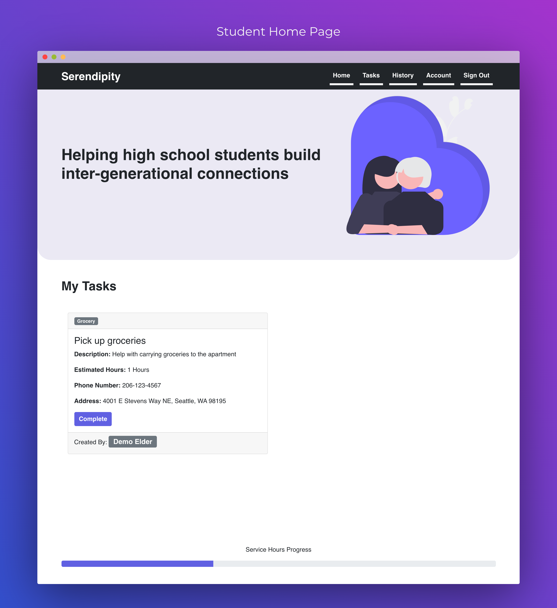
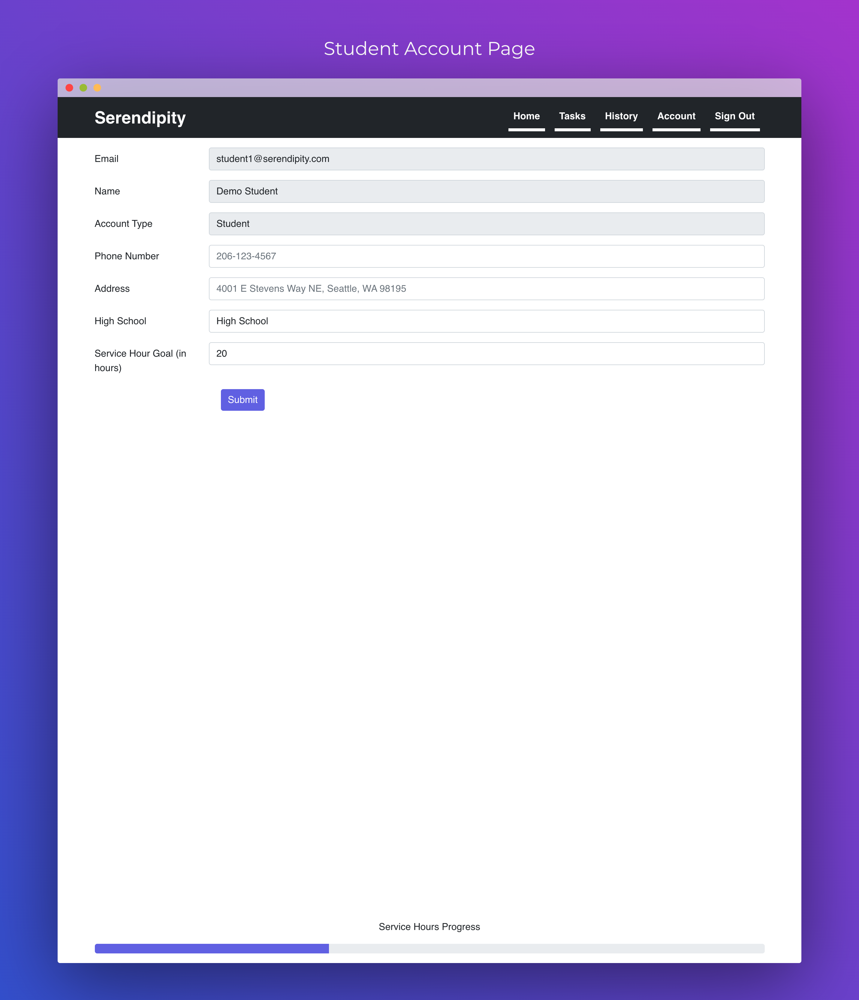
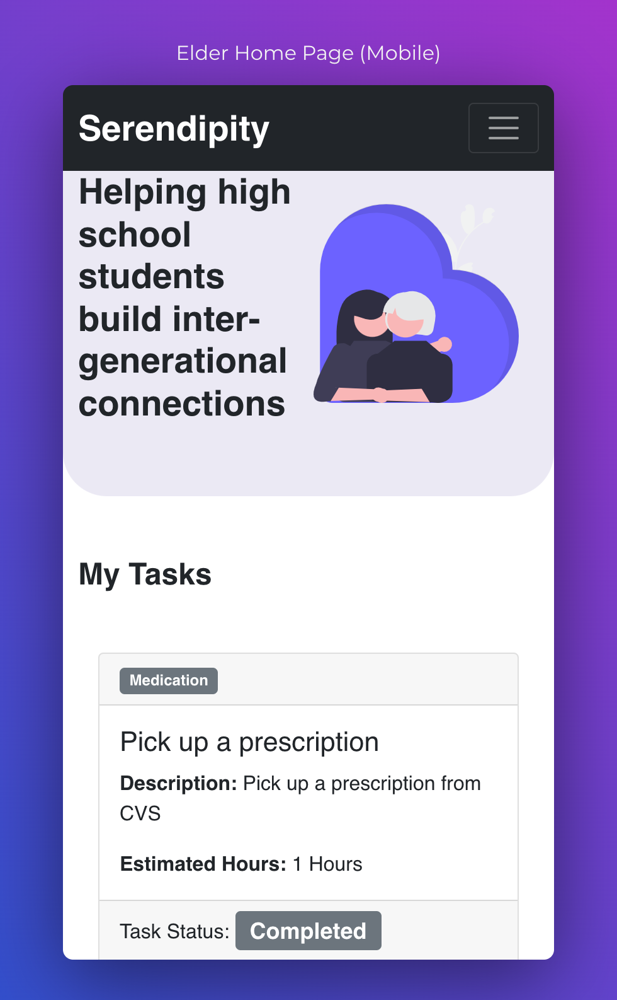
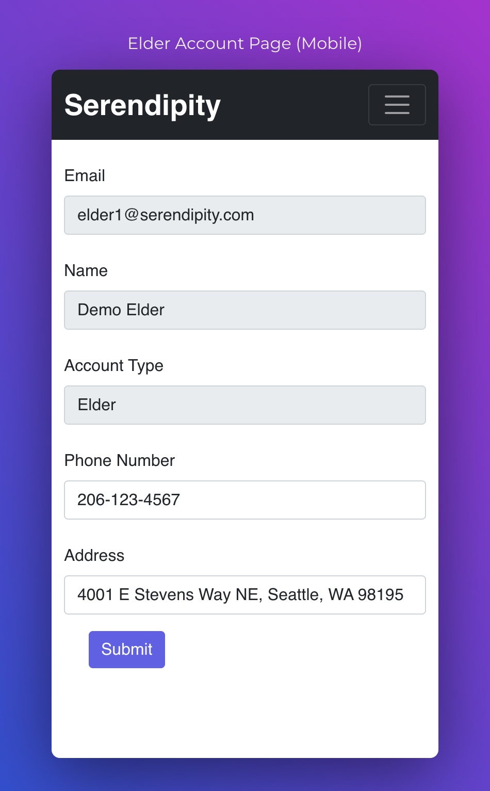
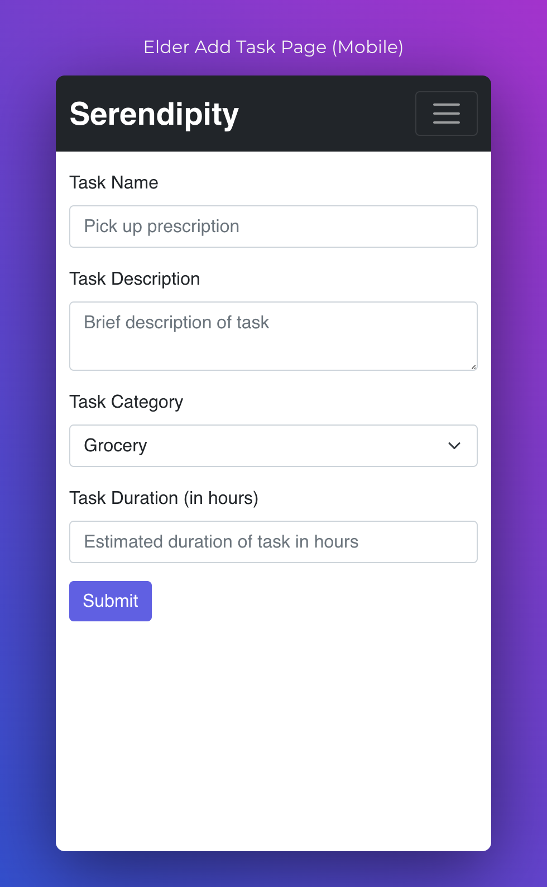

# Serendipity

## [Demo](https://www.youtube.com/watch?v=XJAXYoQ88Qo)

## Tech Stack

[Firebase](https://firebase.google.com/) (Backend)

[Netlify](app.netlify.com) (Hosting)

[React](https://reactjs.org/) (Application)

***Notice for users and stakeholders: Serendipity will be shut down on May 26, 2022***

The project organization on github will be deleted along with the codebase

Firebase project will be deleted along with the collected data

Netlify project will be unlinked and deleted

## Screenshots

